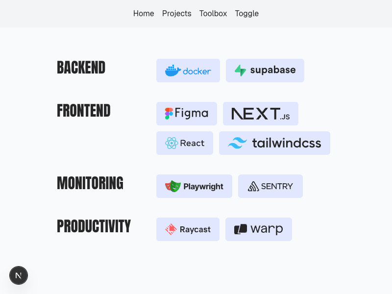

# Feature: Developer Toolbox

As a portfolio viewer, I want to see a list of tools used by the candidate so that I can understand their technical expertise and preferences.

As the portfolio owner, I want the ability to edit my toolbox using the CMS feature so that I can keep my displayed tools current without code changes.

## Must-Have Requirements

- Display a list of development tools used by the portfolio owner
- Retrieve tool data from markdown files using the CMS feature
- Display tool name and logo for each item
- Link each tool to its respective website

## Nice-to-Have Requirements

- Categorize the tools for better organization
- Simple, presentable interface that fits the portfolio aesthetic
- Responsive design that works well on various screen sizes

## Implementation Details

The Toolbox feature provides a visual showcase of development tools and technologies used by the portfolio owner. It leverages the CMS feature to allow easy updates without code changes.

The implementation follows these principles:

1. Data-driven approach using markdown files as the content source
2. Responsive design using container queries for optimal display on all devices
3. Component-based architecture for maintainability

### Content Structure

Each tool's markdown file contains:
- `title`: Name of the tool
- `category`: Group the tool belongs to (defaults to "Other")
- `lexorank`: For sorting within categories
- `url`: Link to the tool's website
- `logo`: SVG markup for the tool's logo

### UI Implementation

1. Tools are grouped by category and displayed in a responsive grid
2. Each tool is rendered as a button that links to its URL
3. The layout uses container queries for responsive design:
   - Category headers scale text size based on container width
   - Tools section switches between 1 and 2 columns based on container width
   - Tool buttons wrap within their container

### Technical Challenges

Finding the right SVG can be difficult, as we want both the icon and the watermark logo beside it in the same pattern. After finding the right SVG, it's often required to modify the HTML - to remove width/height attributes and replace fills with `"currentColor"`. A standard library would be nice, but does not appear to exist at this time.

## UI/Visual Design

The Toolbox implements a clean, grid-based interface that showcases the developer's tools and technologies in an organized, visually appealing manner.

### Key UI Elements

- **Category Headers**: Bold, larger text elements that group tools by category
- **Tool Buttons**: Interactive elements displaying both the tool logo and name
- **Grid Layout**: Responsive container that organizes tools into a clean, readable format

### Responsive Behavior

- **Mobile View**: Single-column layout with full-width tool buttons
- **Tablet/Desktop View**: Two-column layout with tools distributed evenly
- **Container Adaptations**: UI elements scale proportionally within their container rather than based on viewport size

### Accessibility

- Tools are accessible via keyboard navigation with proper tab order
- SVG icons include appropriate aria-label attributes
- Interactive elements have sufficient color contrast
- Focus states are visually apparent

## Dependencies

### Package Dependencies
- [Zod](https://zod.dev/): Validates and creates static types for the Markdown file objects

### Feature Dependencies
- `CMS`: Provides the content retrieval mechanism for tool data
